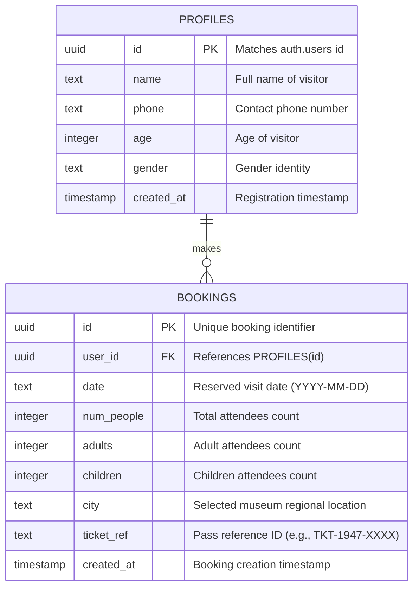

# POWERHOUSE Digital Museum
### Preserving National Heritage & Revolutionizing Cultural Tourism for the 80th Independence Day

[](https://ignite.powerhouse-tech.site/)
[](https://pages.cloudflare.com/)
[](https://github.com/Scam0p/Digital_museum.git)
[](https://react.dev/)
[](https://www.typescriptlang.org/)
[](https://vitejs.dev/)
[](https://tailwindcss.com/)
[](https://supabase.com/)
[](https://github.com/oframe/ogl)

---

<<<<<<< HEAD
## Quick Links & Deployment Info

- **Live Production URL**: [https://ignite.powerhouse-tech.site/](https://ignite.powerhouse-tech.site/)
- **Custom Subdomain**: `ignite.powerhouse-tech.site`
- **Primary Domain**: `powerhouse-tech.site`
- **Cloud Hosting Provider**: Cloudflare Pages (Global Anycast Edge Network)
- **Source Code Repository**: [https://github.com/Scam0p/Digital_museum.git](https://github.com/Scam0p/Digital_museum.git)
- **Target Branch**: `main`

---

## 1. Problem Statement: Heritage & Cultural Tourism Challenge
=======
##  1. Problem Statement: Heritage & Cultural Tourism Challenge
>>>>>>> f3c2f5e6e521beb7cb7ed5d64722f3671aa88399

India's journey to independence is filled with thousands of unsung heroes, indigenous tribal rebellions, and pivotal milestones. However, traditional heritage tourism and historical education face critical challenges today:

1. **Geographic & Physical Access Barriers**: Over 85% of citizens and global enthusiasts cannot physically visit regional freedom museums located across distant historical hubs (e.g., Tamluk, Gohpur, Sivaganga, Khasi Hills).
2. **Static, Unengaging Museum Displays**: Traditional brick-and-mortar archives often rely on static placards and glass cases, failing to engage modern, digital-first audiences.
3. **Fragmentation of Historical Records**: Stories of regional martyrs (e.g., Kanaklata Barua, Matangini Hazra, U Tirot Sing) are scattered across disparate state archives without unified digital verification.
4. **Inefficient Tourism Logistics**: Lack of seamless digital pass booking, verified ID access systems, and unified archival portals creates bottlenecks for museum visitors.

---

<<<<<<< HEAD
## 2. Our Solution: POWERHOUSE Digital Museum
=======
##  2. Our Solution: POWERHOUSE Digital Museum
>>>>>>> f3c2f5e6e521beb7cb7ed5d64722f3671aa88399

**POWERHOUSE Digital Museum** is a web-based, 60 FPS interactive archival platform and digital tourism portal built to democratize Indian history and provide a frictionless guided visit reservation ecosystem:

- **Cinematic 60 FPS 3D Parallax Scrubbing**: A responsive 600-frame sequence rendered onto high-DPI HTML5 Canvas, driven by Lenis smooth-scrolling to provide physical walkthrough immersion.
- **3D Cylindrical Archival Exhibition**: Interactive WebGL-powered 3D circular carousel allowing visitors to rotate, inspect, and open verified archival profile cards.
- **Direct Wikipedia Archive Verification**: Interactive milestone timelines integrated with authoritative Wikipedia incident records.
- **Full-Stack Guided Visit Booking System**: Complete tour reservation engine with date picking, attendee calculation, city selection, dynamic digital pass issuance, and personal visitor dashboard.
- **Dual-Engine Hybrid Backend Architecture**: Seamless live synchronization with Supabase PostgreSQL alongside automatic self-healing local storage failover.
- **Authentic Indian Independence Aesthetic**: Cinematic sitar audio engine, tricolor badges, high-contrast dark museum theme (`#050507`), and glassmorphism styling.

---

<<<<<<< HEAD
## 3. Technology Stack
=======
##  3. Technology Stack
>>>>>>> f3c2f5e6e521beb7cb7ed5d64722f3671aa88399

### Frontend & Visual Architecture
- **Core Framework**: React 18 with TypeScript for type-safe UI logic.
- **Bundler & Dev Server**: Vite with fast HMR and optimized production asset chunking.
- **Styling**: Tailwind CSS, Vanilla CSS, and custom glassmorphism design tokens.
- **Smooth Scrolling Engine**: [Lenis](https://github.com/darkroomengineering/lenis) RAF-synced smooth virtual scroll controller.
- **Motion & Micro-interactions**: [Framer Motion](https://www.framer.com/motion/) for fluid transitions, modals, and stagger reveals.
- **3D & WebGL**: [OGL](https://github.com/oframe/ogl) lightweight WebGL engine for 3D curved image galleries.
- **Icons**: Lucide React.

### Backend, Database & Cloud Infrastructure
- **Hosting & CDN**: [Cloudflare Pages](https://pages.cloudflare.com/) (Edge-cached static assets, automated CI/CD deployments from GitHub).
- **Cloud Database**: [Supabase](https://supabase.com/) (Managed PostgreSQL database with Row Level Security).
- **Authentication**: Supabase Auth with custom visitor credential generator.
- **Resilient Fallback Storage**: Automated offline-first LocalStorage & IndexedDB cache to guarantee 100% uptime during network dropouts or demo evaluations.

### Audio & Multimedia
- **Web Audio API**: Spatial ambient background score with global audio state toggle.
- **Asset Sequence**: Optimized WebP frame sequences (600 frames) preloaded via a 60fps lerp-interpolated preloader.

---

<<<<<<< HEAD
## 4. Database Schema & Architecture
=======
##  4. Database Schema & Architecture
>>>>>>> f3c2f5e6e521beb7cb7ed5d64722f3671aa88399

The application communicates with a PostgreSQL database hosted on Supabase (with automatic local failover if environment variables are not provided).



### SQL Schema Definition:
```sql
-- 1. Profiles Table
CREATE TABLE public.profiles (
  id UUID REFERENCES auth.users ON DELETE CASCADE PRIMARY KEY,
  name TEXT NOT NULL,
  phone TEXT,
  age INTEGER,
  gender TEXT,
  created_at TIMESTAMP WITH TIME ZONE DEFAULT timezone('utc'::text, now()) NOT NULL
);

-- 2. Bookings Table
CREATE TABLE public.bookings (
  id UUID DEFAULT gen_random_uuid() PRIMARY KEY,
  user_id UUID REFERENCES public.profiles(id) ON DELETE CASCADE,
  date TEXT NOT NULL,
  num_people INTEGER NOT NULL DEFAULT 1,
  adults INTEGER NOT NULL DEFAULT 1,
  children INTEGER NOT NULL DEFAULT 0,
  city TEXT NOT NULL,
  ticket_ref TEXT NOT NULL UNIQUE,
  created_at TIMESTAMP WITH TIME ZONE DEFAULT timezone('utc'::text, now()) NOT NULL
);

-- Enable Row Level Security (RLS)
ALTER TABLE public.profiles ENABLE ROW LEVEL SECURITY;
ALTER TABLE public.bookings ENABLE ROW LEVEL SECURITY;
```

---

<<<<<<< HEAD
## 5. External APIs, Cloud Services & AI Tools
=======
##  5. External APIs, Cloud Services & AI Tools
>>>>>>> f3c2f5e6e521beb7cb7ed5d64722f3671aa88399

| Service / Tool | Purpose & Usage |
|---|---|
| **Cloudflare Pages** | Global edge hosting, continuous deployment from GitHub, automated SSL/TLS termination on `ignite.powerhouse-tech.site`. |
| **Supabase Cloud (PostgreSQL)** | Cloud-hosted database for persistent visitor profiles, authentication, and pass reservations. |
| **Wikipedia Public Archives** | Authoritative historical data verification and external incident citations for milestones and freedom fighter profiles. |
| **Web Audio API** | Dynamic audio playback engine for ambient national music. |
| **Google Fonts** | Typography imports (`Playfair Display`, `Italiana`, `Inter`, `Geist`). |
| **DeepSeek & Google Gemini AI** | Assisted during rapid prototyping, sequence asset optimization, and responsive design tuning. |

---

<<<<<<< HEAD
## 6. Getting Started / Local Setup
=======
##  6. Getting Started / Local Setup
>>>>>>> f3c2f5e6e521beb7cb7ed5d64722f3671aa88399

### Prerequisites
- Node.js (v18.0.0 or higher)
- npm or yarn

### Installation Steps

1. **Clone the repository**:
   ```bash
   git clone https://github.com/Scam0p/Digital_museum.git
   cd Digital_museum
   ```

2. **Install dependencies**:
   ```bash
   npm install
   ```

3. **Configure Environment Variables (Optional for Supabase Cloud)**:
   Create a `.env` file in the root directory if connecting to a live Supabase instance:
   ```env
   VITE_SUPABASE_URL=https://your-project.supabase.co
   VITE_SUPABASE_ANON_KEY=your-anon-key
   ```
   *(Note: If no `.env` is provided, the platform automatically boots into high-performance local demo mode with zero configuration needed).*

4. **Run development server**:
   ```bash
   npm run dev
   ```
   Open [http://localhost:5173](http://localhost:5173) in your browser.

5. **Build for production**:
   ```bash
   npm run build
   ```

---

<<<<<<< HEAD
## 7. Team & Engineering Credits
=======
##  7. Team & Engineering Credits
>>>>>>> f3c2f5e6e521beb7cb7ed5d64722f3671aa88399

Developed as part of the **80th Independence Day National Digital Museum Project**:

| Name | USN | Role / Contribution |
|---|---|---|
| **Arjun V** | `1EP24IC007` | 3D WebGL Exhibition & Visual Architecture |
| **Harsh Jangir** | `1EP24IC012` | Archival Data Curation & UI Engineering |
| **Jeevan Jaikumar** | `1EP24IC015` | Full-Stack Integration & Database Architecture |

---

## 8. License & Accreditation
- **Registered MSME**: `UDYAM-KR-03-0720445`
- **Copyright**: © 2026 POWERHOUSE. All rights reserved.
- **Historical Content**: Derived from verified public records of the Indian Freedom Struggle.
